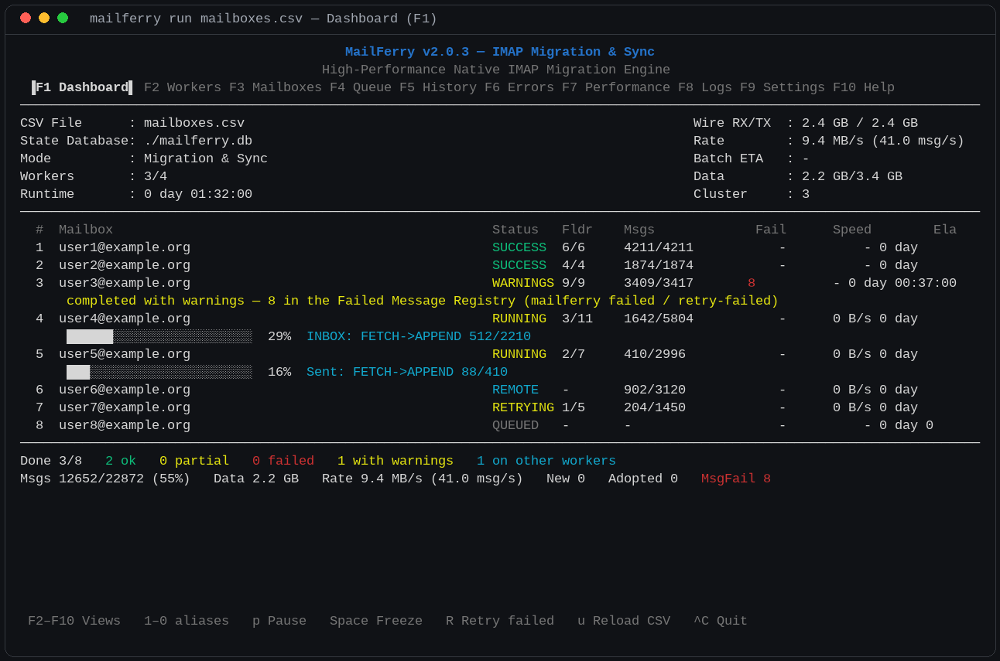
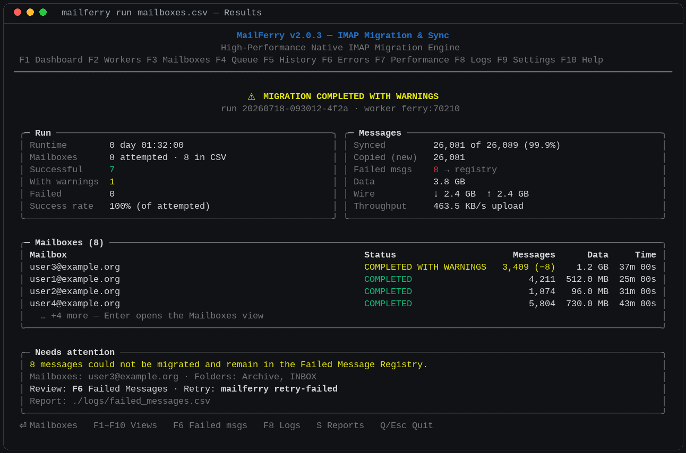
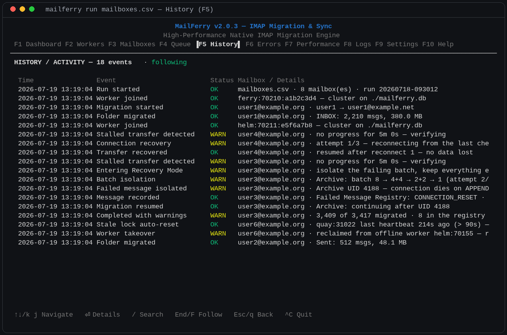

# MailFerry — IMAP Migration & Sync

**High-Performance Native IMAP Migration Engine**

[](LICENSE)
[](https://github.com/ajsap/mailferry/releases)
[](#installation)

MailFerry migrates, synchronises and backs up IMAP mailboxes natively —
no imapsync, no external tools, no runtime dependencies. One static
binary speaks IMAP directly to both servers, streams messages
source-to-destination with bounded memory, and records per-message state
in an SQLite database so every run is resumable and duplicate-free.

> **Release status: `v2.0.3` (stable).**
> v1.0.0 was the original Python implementation; development continued
> unreleased after it and served as the behavioural reference for the
> complete native Go rewrite that is v2, released as stable v2.0.0
> after a three-candidate RC programme.
> Test carefully and keep your source mailboxes until you have verified
> the results. MailFerry never expunges or deletes mail on either server,
> in any mode.

- **Author:** Andy Saputra <andy@saputra.org>
- **Repository:** https://github.com/ajsap/mailferry
- **Support:** https://github.com/ajsap/mailferry/issues
- **Licence:** GNU AGPL v3.0



A migration finishes on a native **Results screen** — verdict, run and
message statistics, per-mailbox outcomes and a concise "Needs
attention" panel when anything is outstanding:



## Why the Go rewrite

| | v1.0.0 (Python) | v2.0.0 (Go) |
| --- | --- | --- |
| Distribution | Python 3.9+ required | **single static binary**, zero dependencies |
| Concurrency | asyncio | goroutines + bounded pipelines |
| Platforms | anywhere with Python | macOS (arm64/amd64), Linux (amd64/arm64), Windows (amd64/arm64) |
| TUI | hand-rolled ANSI | Bubble Tea + Lip Gloss, compiled in |
| State | SQLite | SQLite (pure Go driver, **no CGO**) — same schema, byte-compatible fingerprints |

The final (unreleased) Python development line is preserved on the
permanent `legacy/python-final` branch as the behavioural reference; the
Go engine reached feature parity with it before this RC (see
`docs/PARITY-v2.0.0-RC.md`).

## Feature status in v2.0.0

**Implemented** (covered by the automated suite):

- Native IMAP engine: pipelined FETCH→APPEND streaming, LITERAL+,
  STARTTLS/SSL, inactivity watchdogs, per-host connection budgets,
  COMPRESS=DEFLATE (auto when the server offers it)
- Per-message SQLite State Database: resume, incremental top-up,
  duplicate-free adoption of pre-existing destination mail, ack-lost
  APPEND reconciliation (a connection loss never double-copies a message)
- Self-healing: stall detection → connection recovery → **Recovery
  Mode** → progressive failed-message isolation (batch → halves → single)
- **Failed Message Registry**: persistent record of messages a server
  refuses (`mailferry failed`, `retry-failed`, `--ignore`), skipped on
  future runs, **COMPLETED WITH WARNINGS** instead of endless retry loops
- Interactive TUI (ten F1–F10 views incl. live dashboard, History,
  follow-mode Logs), automatic TTY detection, `--no-tui` headless mode,
  `status` read-only inspection, graceful shutdown with bounded escalation
- Multi-instance clustering: several MailFerry processes share one State
  Database, mailboxes are claimed atomically, offline workers are
  reclaimed automatically *(implemented + tested; still under real-world
  validation at RC stage — see Known limitations)*
- mailferry.toml configuration (auto-generated, documented, never fatal)
- Wrapper-compatible CSV input, folder mapping/include/exclude, Gmail
  virtual-folder handling, `--sync-flags` backup mode, `--order size`,
  NDJSON logs, protocol trace with credential redaction

- **Whole-file CSV validation** — every error reported in one pass
  before anything starts; passwords never echoed
- **`--dry-run`** — a genuine read-only run: mutating IMAP commands are
  blocked inside the client before any byte reaches the wire, state is
  kept in memory only, and a DRY RUN summary shows the effective plan
- **ISO 8601 date-range migration** — `--from` / `--to`
  (`YYYY-MM-DDTHH:MM:SS`, optional offset or `Z`; both bounds inclusive;
  IMAP INTERNALDATE is authoritative; the resolved window is persisted
  so resume is deterministic)
- **`mailferry dedup`** — explicit destination deduplication: analysis
  by default (report only); `--execute` moves duplicates to a
  MailFerry-Quarantine folder or flags them `\Deleted` without
  expunging — reversible by design; strong Message-ID + size +
  fingerprint matching (uncertain = retained); interruption-safe
- **`mailferry attach`** — read-only live monitor of a running headless
  migration (1 Hz State-Database snapshots + session-log tail); attach,
  detach and re-attach freely — workers are never disturbed
- **`--portable`** — self-contained mode: configuration, State
  Database, logs and cache live beside the executable

**Planned for v2.1.0**: OAuth 2.0 (XOAUTH2/OAUTHBEARER), MULTIAPPEND,
QRESYNC delta sync, permanent quarantine purge.

## Installation

Download the binary for your platform from the
[Releases page](https://github.com/ajsap/mailferry/releases), verify the
checksum, make it executable, run it. There is nothing else to install.

```sh
shasum -a 256 -c SHA256SUMS          # verify (macOS: shasum, Linux: sha256sum)
chmod +x mailferry-v2.0.3-darwin-arm64
./mailferry-v2.0.3-darwin-arm64 version
```

Targets: `darwin-arm64` (all Apple Silicon), `darwin-amd64` (Intel Macs),
`linux-amd64`, `linux-arm64`, `windows-amd64.exe`, `windows-arm64.exe`.

> **macOS Gatekeeper:** this release candidate's macOS binaries are not
> yet Apple-notarised, so Gatekeeper may block the first launch — a
> one-time **Open Anyway** approval is expected for this RC. Follow the
> step-by-step guide in
> [docs/INSTALLATION-MACOS.md](docs/INSTALLATION-MACOS.md); never disable
> Gatekeeper.

Building from source instead: Go 1.22+, then `go build ./cmd/mailferry`
from the repository root — or `./build.sh` for all six release targets
(reproducible: `CGO_ENABLED=0 -trimpath`).

## Quick start

```sh
mailferry init mailboxes.csv        # write a template
$EDITOR mailboxes.csv               # fill in your mailboxes
mailferry check mailboxes.csv       # preflight: connect, auth, estimate — no writes
mailferry mailboxes.csv             # migrate (same as: mailferry run mailboxes.csv)
```

Re-running the same command is always safe: MailFerry resumes from its
State Database, verifies, and copies only what is missing.

### CSV format (fictional example — use your own servers)

```csv
srchost,srcport,srcsecurity,srcuser,srcpassword,dsthost,dstport,dstsecurity,dstuser,dstpassword
imap.example.com,993,ssl,jeslyn@example.com,SourcePassword,imap.example.org,993,ssl,jeslyn@example.org,DestinationPassword
```

`srcsecurity`/`dstsecurity` accept `ssl`, `tls` (STARTTLS) or `none`.
Source Server columns are `src*`; Destination Server columns are `dst*`
(the v1 `old*`/`new*` header is rejected with a clear rename hint). The CSV holds plaintext
credentials — protect the file accordingly; MailFerry itself never writes
passwords into its State Database, logs or reports.

### Frequently used flags

```
--workers N            concurrent mailboxes (default 10)
--db PATH              State Database (default: native per-user mailferry.db)
--logs-dir DIR         logs (default: native per-OS location)
--skip-completed       skip mailboxes already recorded SUCCESS
--include/--exclude G  folder filters (repeatable), --map FILE renames
--sync-flags           re-apply changed flags to already-synced mail
--order csv|size       admission order
--compress auto|off    COMPRESS=DEFLATE (default auto)
--no-tui               headless output   --trace  redacted protocol trace
```

Run `mailferry run -h` for the full list, `mailferry --help` for all
commands (`status`, `failed`, `retry-failed`, `verify`, `doctor`,
`capabilities`, `benchmark`, `compact`, `import-state`, `config`,
`changelog`, `roadmap`, …).

## Configuration, state and where files live

MailFerry works with no configuration at all, and it is tidy about your
filesystem:

- **Informational commands create nothing.** `--help`, `version`,
  `about`, `changelog`, `roadmap` and `config paths` are strictly
  read-only — no configuration, no directories, no database appear just
  because you looked at the help.
- **Everything is created lazily**, on the first *operational* run
  (`mailferry run …`) or when you explicitly ask (`mailferry config`).
  Only what an operation actually needs is created.
- **One State Database per user** — `mailferry.db` in the native
  application-state location (below), shared by all runs, so working
  from `~/Downloads` today and `~/Documents` tomorrow resumes the same
  state. Override with `--db PATH` or in `mailferry.toml`.
- Your **migration CSVs stay wherever you keep them** — MailFerry never
  relocates user files.

Native default locations (`mailferry config paths` shows yours):

| | macOS | Linux (XDG) | Windows |
| --- | --- | --- | --- |
| Configuration | `~/Library/Application Support/MailFerry/mailferry.toml` | `$XDG_CONFIG_HOME/mailferry/mailferry.toml` (`~/.config/…`) | `%APPDATA%\MailFerry\mailferry.toml` |
| State Database | `~/Library/Application Support/MailFerry/mailferry.db` | `$XDG_STATE_HOME/mailferry/mailferry.db` (`~/.local/state/…`) | `%LOCALAPPDATA%\MailFerry\mailferry.db` |
| Logs | `~/Library/Logs/MailFerry/` | `$XDG_STATE_HOME/mailferry/logs/` | `%LOCALAPPDATA%\MailFerry\Logs\` |
| Cache | `~/Library/Caches/MailFerry/` | `$XDG_CACHE_HOME/mailferry/` | `%LOCALAPPDATA%\MailFerry\Cache\` |

Precedence is deterministic: **CLI flags → `mailferry.toml` → native OS
default**. A `./mailferry.toml` in the working directory is also
honoured (or use the explicit `--portable` mode).

The generated `mailferry.toml` is fully documented, ships every option
at its built-in default, is never overwritten, and can never stop
MailFerry by being missing or broken. When a future version introduces
new options they are appended as commented defaults — your settings are
untouched.

## The TUI

An interactive terminal is detected automatically: you get the live
dashboard (per-mailbox progress, wire-speed, ETA, warnings) plus nine
more views on **F1–F10** — Workers (cluster), Mailboxes, Queue,
History/Activity, Errors, Performance, Logs, Settings, Help. Digits
**1–0** mirror the F-keys for terminals that intercept them. `Enter`
opens details, `/` searches, `p` pauses, `r`/`R` retries failed
mailboxes, `u` picks up rows newly added to the CSV, `Space` freezes the
display, `F8` logs follow like `tail -f` (scroll to browse, `F` to
re-follow). `Ctrl+C` opens the graceful-shutdown dialog; a second
`Ctrl+C` forces an immediate exit with state intact.



The TUI is a pure consumer of the engine's event bus: a rendering
problem, terminal resize or lost SSH session can never corrupt migration
state.

## SSH, tmux and headless operation

- **SSH:** run MailFerry normally inside the SSH session; the TUI works
  over SSH from macOS, Linux and Windows clients. If the connection
  drops, the process receives SIGHUP and shuts down gracefully — per-UID
  state is committed, so re-running resumes exactly where it stopped, and
  worker leases mean an abandoned run's mailboxes are reclaimed
  automatically. No mailbox is ever left permanently locked.
- **tmux/screen (recommended for long remote migrations):** start inside
  `tmux new -s mailferry` (or `screen`), detach with `Ctrl+B D`, and the
  migration continues with the TUI intact; reattach any time with
  `tmux attach -t mailferry`.
- **Headless:** `--no-tui` (or any non-interactive stdin/stdout, e.g.
  cron, CI, `nohup`, pipes — detected automatically) prints clean status
  lines instead. `mailferry status` inspects a
  running or finished migration read-only from another shell, and
  `--json-logs` / `--json-progress` emit NDJSON for machine consumption.

## Resume, recovery and the Failed Message Registry

- **Resume:** every message is committed to the State Database only after
  the destination confirms it. Interrupt anything — Ctrl+C, crash, power
  loss — and the next run continues from the last confirmed message.
  After an interrupted APPEND, MailFerry *reconciles* with the
  destination rather than assuming failure, so ambiguous windows cannot
  produce duplicates.
- **Stall recovery:** a mailbox with no measurable progress for
  `stale_timeout_seconds` (default 5 min) is verified, its connections
  recycled, and the transfer resumes from checkpoint — automatically.
- **Recovery Mode:** when the same batch keeps breaking the connection,
  MailFerry isolates it progressively (8 → 4+4 → 2+2 → 1) until the
  poisonous message is identified, records it in the **Failed Message
  Registry** with full metadata and failure type, skips it on future
  runs, and finishes the mailbox as **COMPLETED WITH WARNINGS** — a few
  bad messages never hold the other thousands hostage.
- Inspect and manage: `mailferry failed` (list/export `--json`/`--csv`,
  silence with `--ignore`), `mailferry retry-failed` re-queues entries;
  successes become RECOVERED.

## Troubleshooting the terminal

If shell output ever appears as a "stair-step" (each line starting
where the previous one ended), a previously crashed full-screen program
left the terminal without newline post-processing. MailFerry v2.0.2+
repairs this automatically before printing anything (a one-line
`note: repaired inherited terminal state (…)` says so) and always hands
the terminal back sane. `mailferry term-diag` is a supported self-test
(no servers, no data), and `MAILFERRY_TERM_DIAG=FILE` records termios
flags at every lifecycle stage — flags only, never mailbox data.

## Known limitations

- macOS binaries are unsigned / not notarised (see Installation).
- Clustering and COMPRESS=DEFLATE are implemented and tested against the
  automated suite but still under real-world validation; `--compress off`
  and single-instance operation are the conservative fallbacks.
- Windows console: built and cross-compiled, limited interactive testing.
- Report issues: https://github.com/ajsap/mailferry/issues — a
  `mailferry doctor` output and the relevant `logs/*.log` lines (they
  contain no credentials) make reports actionable.

## Repository layout

The repository root is the canonical Go module — normal Go conventions
work directly after cloning:

```sh
git clone https://github.com/ajsap/mailferry
cd mailferry
go build ./cmd/mailferry     # or: ./build.sh for all six release targets
go test ./...
```

```
cmd/mailferry/   the mailferry command
internal/        engine, IMAP client, TUI, state, config, reports…
docs/            parity audit, macOS release pipeline, CSV format
build.sh         reproducible six-target release build
```

**Where is the Python implementation?** v1.0.0 (the original Python
release) lives at the `v1.0.0` tag, and the final unreleased Python
development line (1.2.0-dev — the behavioural reference for this
rewrite) is preserved permanently on the
[`legacy/python-final`](https://github.com/ajsap/mailferry/tree/legacy/python-final)
branch. Nothing was discarded; `main` is Go-only from v2 onward.

## Licence

GNU Affero General Public License v3.0 — see `LICENSE`.
Copyright (C) 2026 Andy Saputra <andy@saputra.org>.
Contributions welcome: issues, feature requests and pull requests at
https://github.com/ajsap/mailferry.
