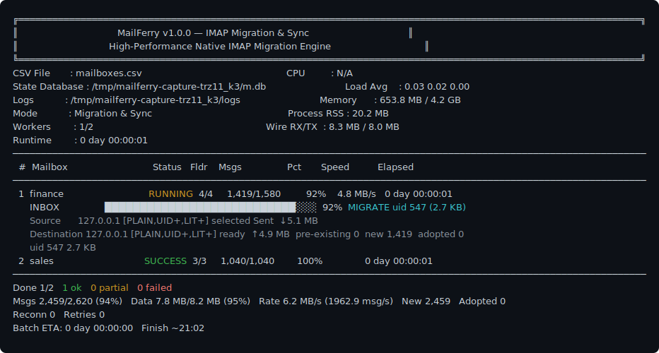

# MailFerry – IMAP Migration & Sync

**High-Performance Native IMAP Migration Engine**

[](LICENSE)
[](#installation)
[](https://github.com/ajsap/mailferry/releases)
[](#installation)

MailFerry migrates, synchronises and backs up IMAP mailboxes by speaking the
IMAP protocol natively — no imapsync, no Perl, no shell-outs, and **zero
third-party packages**. One standalone file to deploy; the only requirement
on the machine is Python.

---

## Features

- **Native asyncio IMAP protocol core** — pipelined transfers, non-blocking uploads
  (`LITERAL+`), wire compression (`COMPRESS=DEFLATE`), capability-driven
  optimisation with a conservative `--baseline` mode for quirky servers.
- **Migration, sync and backup in one command** — empty destinations are
  migrated; destinations pre-synced by other tools are *adopted* via
  fingerprint matching (never duplicated); repeat runs top up only new mail,
  so a cron entry turns MailFerry into a mailbox backup job.
- **Never duplicates, never loses mail** — per-message state in a SQLite
  State Database, intent rows before every APPEND, `APPENDUID` confirmation,
  UIDVALIDITY-aware re-verification, and bounded crash reconciliation. Even
  deleting the State Database only triggers a re-adoption scan.
- **Resume from anything** — crash, `kill -9`, reboot, power cut, dropped
  network: run the same command again and MailFerry continues exactly where
  it stopped.
- **Streaming transfers** — messages stream from the Source Server to the
  Destination Server in constant memory; multi-GB messages are fine.
- **A Dashboard that can't lie** — byte counters tick on every socket
  read/write and every phase shows a live operation verb, so slow is visibly
  slow and never silently "stalled".
- **Fidelity** — flags, keywords, read state, internal dates, folder
  hierarchy, special-use folder mapping (Sent/Trash/Junk/Drafts/Archive in
  any language), and Unicode folder names (mUTF-7).
- **Scales out and in** — thousands of mailboxes per CSV, worker pools,
  per-host connection budgets, parallel folder pipelines inside large
  mailboxes, throttle-aware backoff.
- **Operator-grade reporting** — live Dashboard, session log, per-mailbox
  logs, `results.csv`, optional NDJSON logs and progress streams, protocol
  trace mode.

## Installation

MailFerry is a single self-contained file. No pip, no virtualenv, no
dependencies — just Python 3.9+ (3.12+ recommended) on macOS or Linux.

```bash
# grab the latest release
curl -LO https://github.com/ajsap/mailferry/releases/latest/download/mailferry.pyz
chmod +x mailferry.pyz
./mailferry.pyz --version
```

From source:

```bash
git clone https://github.com/ajsap/mailferry.git
cd mailferry
python3 -m mailferry --version
```

## Quick Start

```bash
./mailferry.pyz init mailboxes.csv        # write a CSV template
vi mailboxes.csv                          # fill in your accounts
./mailferry.pyz check mailboxes.csv       # preflight: auth, folders, estimates — writes nothing
./mailferry.pyz mailboxes.csv --workers 6 # migrate
./mailferry.pyz mailboxes.csv             # run again any time: syncs only new mail
```

Interrupted? Crashed? Rebooted? **Run the same command again.**

## CSV Format

Header row required; one mailbox per line:

```csv
oldhost,oldport,oldsecurity,olduser,oldpassword,newhost,newport,newsecurity,newuser,newpassword
mail.old.com,993,ssl,john@old.com,Secret1,mail.new.com,993,ssl,john@new.com,Secret2
```

`oldsecurity` / `newsecurity`: `ssl` (implicit TLS) · `tls` (STARTTLS) · `none`.

## The Dashboard



The Dashboard shows global progress (messages and data with percentages,
live throughput, ETA, duplicates prevented, reconnects, retries) and, per
mailbox, the current folder, operation verb, transfer speed, and detailed
Source Server / Destination Server lines: host, negotiated capabilities,
connection state, traffic, pre-existing vs newly migrated vs adopted
messages. When output is redirected, MailFerry switches to timestamped
status lines; `--json-progress` emits machine-readable snapshots.

## Migration, Sync & Backup Semantics

| Situation | What MailFerry does |
|---|---|
| Destination folder empty | fast native migration |
| Destination already has mail (synced earlier by imapsync or any tool — or the State Database was lost) | **adoption**: fingerprint scan records existing messages as done — nothing is migrated twice |
| State Database knows the folder | **incremental sync**: only new messages migrate; deletions are never propagated (true backup behaviour); `--sync-flags` re-applies flag changes |

Details: fingerprints use the Message-ID (with a header-hash fallback),
count-aware multiset matching preserves genuine duplicates, and UIDVALIDITY
changes trigger re-verification rather than blind re-migration.

## Supported Servers

MailFerry targets any RFC 3501-compliant server and adapts to advertised
capabilities (UIDPLUS, LITERAL+, COMPRESS=DEFLATE, CONDSTORE/QRESYNC,
SPECIAL-USE, LIST-STATUS, STATUS=SIZE, APPENDLIMIT, NAMESPACE, ID, …).

Tested/targeted families: **Dovecot** (and Mailcow), **Gmail / Google
Workspace** (label-aware: `[Gmail]/All Mail` and `Important` excluded by
default, `--gmail-all-mail` to include), **Exchange / Exchange Online**
(app passwords; OAuth planned), **Cyrus**, **Courier** (`INBOX.` namespace
translation), **Zimbra**, **Kerio**, **IceWarp**, **Axigen**,
**SmarterMail**, **MailEnable**. For older or unusual servers,
`--baseline` forces the plain RFC 3501 path, and
`mailferry capabilities HOST PORT` shows exactly what will be negotiated.

## Commands & Key Options

```
mailferry run CSV            migrate / sync (default command)
mailferry check CSV          preflight — connects, lists, estimates; writes nothing
mailferry init FILE          write a CSV template
mailferry import-state FILE  import the legacy wrapper's migration.state
mailferry capabilities H P   probe a server's capabilities & optimisation plan
mailferry verify CSV         compare Source / Destination / State Database counts
mailferry compact            prune per-message rows for completed folders
mailferry --version | --about | --help
```

Frequently used options: `--workers`, `--max-conns-per-mailbox`,
`--per-host-conns`, `--retries/--retry-delay` (authentication failures are
never auto-retried), `--include/--exclude/--map`, `--sync-flags`,
`--skip-completed`, `--rescan-dest`, `--ephemeral`, `--order size`,
`--compress off`, `--tls-no-verify`, `--baseline`, `--json-logs`,
`--json-progress`, `--trace`. Run `mailferry run --help` for the full list.

## Resume & Reliability

- State Database (`migration.db`, SQLite WAL) records every message's
  journey: planned → inflight → done/skipped, with source and destination
  UIDs and fingerprints.
- Exit codes: `0` success · `1` failures or partial · `130` interrupted ·
  `141` broken pipe.
- First `Ctrl+C` stops gracefully (in-flight batches commit); a second one
  stops immediately. State stays consistent either way.
- Transient network failures reconnect and resume mid-folder with
  exponential backoff; server throttling is respected without burning
  retry budgets.

## Roadmap

- MULTIAPPEND batching for small-message workloads
- QRESYNC/CONDSTORE delta passes and flag-change sync at scale
- OAuth 2.0 (XOAUTH2 / OAUTHBEARER) via the pluggable authentication seam
- Chaos-proxy hardening suite and public benchmark harness
- Multi-loop sharding for >1 Gbps deployments

## FAQ

**Is it safe to run repeatedly?** Yes — that's the design. Runs are
idempotent; completed messages are never migrated twice.

**Can it replace my imapsync scripts?** Yes. The CSV format is compatible,
`import-state` migrates your wrapper history, and obsolete flags explain
their replacements.

**What about mailboxes with 100 GB+ / millions of messages?** Messages
stream in constant memory; state is per-UID; resume starts in seconds.

**Does it delete anything?** No. MailFerry never expunges or deletes on
either server in v1.

## Contributing

Contributions are welcome — see [CONTRIBUTING.md](CONTRIBUTING.md) for the
development setup, test suite, branding rules and release process. Please
use [GitHub Issues](https://github.com/ajsap/mailferry/issues) for bugs and
feature requests, and read our [Code of Conduct](CODE_OF_CONDUCT.md).

## License

Licensed under the **GNU Affero General Public License v3.0** — see
[LICENSE](LICENSE). © 2026 Andy Saputra.

## Author

**Andy Saputra** · <andy@saputra.org> · [saputra.org](https://saputra.org)

- Repository: <https://github.com/ajsap/mailferry>
- Issues: <https://github.com/ajsap/mailferry/issues>
- Changelog: [CHANGELOG.md](CHANGELOG.md)

## Acknowledgements

MailFerry stands on the shoulders of the IMAP RFC authors and of
[imapsync](https://imapsync.lamiral.info/) by Gilles Lamiral, whose two
decades of accumulated edge-case wisdom set the bar for what a migration
tool must survive.
